<h1 align="center">Hi 👋, I'm Zohaib Rustam</h1>
<h3 align="center">Unity Developer | AR/VR Specialist | UI/UX Designer</h3>

  

---

## 📝 About Me:

- 🎮 Unity Developer specializing in C# and interactive 3D applications
- 🕶️ AR Foundation - Built mobile AR reconstruction of Roman Colosseum
- 🎨 UI/UX Designer at Devconst
- 🎓 MSc Computing with Digital Media from University of Sussex (2:1)
- 📍 Based in Brighton, UK
- 📫 **How to reach me:** zohaibbrustamm@gmail.com

---

## 🔗 Connect with me:

  
  
  

---

## 🛠️ Tech Stack:

### Game Development

### AR/VR Development

### Web Development

### Programming Languages

### Design Tools

### Tools & Platforms

---

## 📊 GitHub Stats:

  
  

  

---

  <i>"Building immersive AR/VR experiences and interactive 3D applications"</i>

  📍 Brighton, UK | 🎮 Unity Developer | 🕶️ AR Foundation Specialist | 🌐 Three.js Enthusiast

